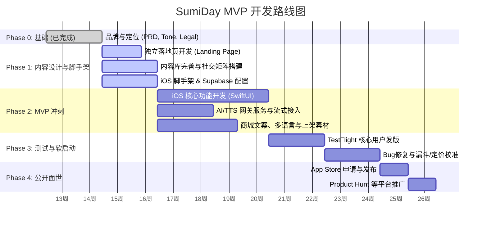

# SumiDay 开发总纲与流程全景图 (Master Process & Roadmap)

这份文档是为你（Chairman）量身定制的**开发导航图**。鉴于你希望拥有上帝视角以防遗漏或返工，这份总纲将清晰地理出每个阶段的**任务分解**、**并行线**（你做什么，我做什么）、**关键里程碑**以及随时可启用的**Claude 专属技能 (Skills)**。

---

## 🗺 全局流程图 (Mermaid 分支可视)

---

## ✅ Phase 0 — 基础搭建核心 (已完成)
**状态：已完成**
- **已产出**：`CLAUDE.md`, `DECISIONS.md`, `prd-v1.md`, `visual-system.md`, 基础 `legal` 文档。
- **决定点**：确认了项目定位（Zen First, 多模型接入, $0.99 起步买断）。

---

## 🏃 Phase 1 — 内容、设计与应用脚手架 (当前阶段)
**核心目标**：开始收集早期用户邮箱 (Landing Page)；建立开发框架；跑通全套内容流转。

### 并行任务线

#### A. Chairman线 (你的工作)
1. **iOS 项目初始化**：使用 Xcode 搭建工程，接入 Swift String Catalogs (`en` 为基础)，套用 `visual-system.md` 设置全局 Color 和 Typography。
2. **Supabase 准备**：
   - 建立基础表结构（根据 `prd-v1.md` 的 Data Model，设计 `User`, `Path`, `Session`, `ai_config` 等）。
   - 开启 Email Auth 或 Apple Sign in 预备。
3. **域名与邮件绑定**：为 `sumi.day` 设置 DNS 解析，便于落地页上线。

#### B. GM线 (我的工作，建议在独立对话/窗口执行以防上下文污染)
1. **Landing Page 生成**：快速写一版用于收集邮箱的静态落地页。
   - 💡 *技巧：你可以对我说：“开一个新窗口，请使用 `ui-ux-pro-max` 或 `frontend-design` skill 帮我在 sumi.day 域名下设计个符合东方禅意 (kinfolk) 风格的高级落地页模板”。*
2. **社媒试运行准备**：利用 X/IG API 完成自动化发布的 Zapier / Make.com / Buffer 链路。
3. **声音生成 (ElevenLabs)**：整理全部 37 个 Session 的音频生成脚本（批量处理）。

### ⚠️ Phase 1 防坑指南：
- **别急着写业务逻辑**：在 iOS 端先只写骨盆和样式层（把 `visual-system.md` 落实到 `Color+Extension.swift` 和 `Font+Extension.swift` 里），组件级预览没问题了再动业务。
- **避免用复杂架构**：如果是 iOS 独立开发，使用标准的 `MVVM` 或简单的 `ObservableObject` 即可。

---

## 🛠 Phase 2 — MVP 全核心开发流水线
**核心目标**：完成 iOS 开发和 AI 网关层，App 完整可运行。

### 并行任务线

#### A. Chairman线 (iOS + AI Gateway)
1. **AI 服务网关 (Gateway) 搭建**：在 Aliyun HK 部署 Node.js / Python 脚本，或者直接用 Supabase Edge Functions 写一个通过 SSE (Server-Sent Events) 流式推送的对话中间件。
   - 💡 *提示：让 Claude 提供完整健壮的重试与 SSE 编解码方案代码。*
2. **核心体验层 (iOS)**：
   - 阅读器与音频控件 (`ElevenLabs` m4a 音频流播放、离线缓存）。
   - 动画效果（实现 PRD 里的墨水化开（Ink Wash Reveal）等过渡）。
3. **支付与订阅 (StoreKit 2 / RevenueCat)**：重点是支付逻辑与状态验证。

#### B. GM线 (资产生成)
1. **翻译与内容**：西班牙语（ES）第一版的本地化文案，处理版权说明（Copyright matrix）。
2. **App Store 上架包装**：
   - 应用商店副标题、文案、推广词（利用 SEO/ASO 知识）。
   - 截图文案与分层设计（截图最好能利用设计工具模板自动合成）。
   - *你可以说：“我们来做 App Store 的文案，请用你对于 ASO 的研究帮助我撰写。”*

### ⚠️ Phase 2 防坑指南：
- **TDD (测试驱动测试)**：因为你担心返工，特别是在写支付和 Auth 时，你可以让我用 `test-driven-development` skill，先写出期望跑通的用例。
- **关于 AI 幻觉和上下文长度**：AI Gateway 的 prompt 设计极度关键。当在做这部分测试时，可以让 Claude 使用 `advanced-evaluation` 确保其不跑题且风格严肃。

---

## 🧪 Phase 3 — 软启动与内部校验
**核心目标**：50-100名用户试用，排查致命Bug。

1. **TestFlight 开启**：将阶段1 Landing Page 累计的邮箱用于 TestFlight 邀请。
2. **内测关注点**：
   - AI 对话是否常常超时？如果是，优化 Gateway 的超时容忍度和国内/海外节点的网络连通性。
   - 离线模式读取缓存是否正常？
   - 支付是否顺畅（沙盒环境，以及初版的 $0.99 转化是否符合预期）。
3. **快速修 Bug (系统化 Debug)**：
   - 💡 *此时若遇到复杂 Bug，你可直接说：“调用 `systematic-debugging` skill，帮我查一查为什么偶发性音频播放闪退”。*

---

## 🚀 Phase 4 — 上下架与公开发布
**核心目标**：从黑盒走向台面。

1. **审核与合规**：“Not medical advice” 的弹窗/说明必须在此阶段前落实（我已为你放在 legal 目录）。
2. **推广宣发**：
   - 在 X / Reddit / Product Hunt 提交。我（GM）会提前为你写好各个社群最本土化的软文帖子！
   - Apple Editorial App Store 官方推荐信准备（主打：“第一款真正的东方古法智慧 AI 对话应用”）。

---

## 🧠 推荐日常沟通与提问范式

作为 Chairman，你只需要给我下指令。这里是几个推荐的“常用话术”以确保我能最高效动用系统能力：

- **设计/排版需要时**：
  *“这是一个新任务。请用 `frontend-design`（或 `ui-ux-pro-max`）帮我在当前目录下起一个简单的 Web Landing Page 草架。”*
- **开发复杂核心逻辑前（预防返工）**：
  *“我要开始写 iOS 里的 StoreKit 2 的支付拦截器了，调用 `writing-plans` 帮我先写一个实施计划（Implementation Plan）我过目后再写代码。”*
- **写代码遇到坑时**：
  *“这块 SSE 报连接断开错误，调用 `systematic-debugging` 帮我看看日志。”*
- **需要并行处理庞大材料时**：
  *“我们在当前的终端处理代码，我现在需要你再分心去处理下西班牙语的 120 篇翻译，请新开一个独立对话通过 `subagent-driven-development` 去完成。”*

**总结**：先写 UI 壳和样式树 ➡️ 建表连通后端数据库 ➡️ 搭建 AI Gateway 跑通流式协议 ➡️ 接 RevenueCat 和功能缝合 ➡️ UI 和微动画的高级调优。
每一步拿不准时，让我出 Plan！按此执行，能最大程度避开技术栈推翻重来的风险。
